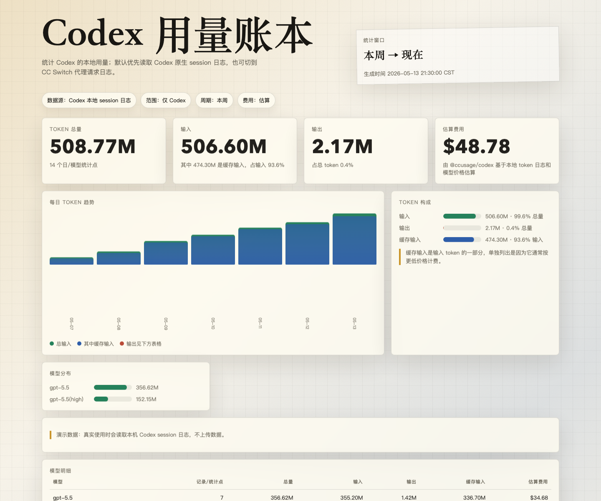

# Codex Usage Dashboard

一个本地 Codex 用量仪表盘。运行 `codex-usage`，它会生成并打开中文 HTML 报告，统计 input / output / cached input token、模型分布、每日趋势和估算费用。

它默认优先读取 Codex 自己的 session 日志，并复用 [`@ccusage/codex`](https://www.npmjs.com/package/@ccusage/codex) 做 token 统计；需要代理链路或供应商切换口径时，也可以切到 CC Switch 的本地请求日志。




> 截图使用演示数据生成，不包含真实本地用量。

## 适合谁

- 你用 Codex CLI / Codex Desktop。
- 你想看本周、本月、近 30 天的 Codex token 用量。
- 你可能用 CC Switch 切多个供应商，也可能完全不用 CC Switch。
- 你想把一个开源链接丢给 AI agent，让它帮你装好并解释以后怎么用。

## 快速使用

推荐用 `pipx` 安装：

```bash
pipx install git+https://github.com/YUHAO-corn/codex-usage-dashboard.git
codex-usage
```

也可以直接 clone 后运行：

```bash
git clone https://github.com/YUHAO-corn/codex-usage-dashboard.git
cd codex-usage-dashboard
python3 bin/codex-usage
```

默认会生成并打开：

```text
~/codex-usage-dashboard.html
```

## 数据源

默认 `--source auto`：

- 如果存在 `~/.codex/sessions/**/rollout-*.jsonl`，优先使用 Codex 本地真实日志。这个口径更适合统计 Codex 总 token，不是 mock 数据。
- 如果 Codex session 解析器不可用，但存在 `~/.cc-switch/cc-switch.db`，自动退回 CC Switch 本地 SQLite。
- 如果你想强制看代理链路口径，可以运行 `codex-usage --source cc-switch`。

Codex session 口径需要 `ccusage-codex`。建议先安装一次：

```bash
npm install -g @ccusage/codex
codex-usage
```

如果没有全局安装，工具会尝试用 `npx` 临时运行 `@ccusage/codex`，首次运行需要网络和 Node.js。

## 给 AI Agent 的安装提示

如果你是 Codex、Claude Code 或其它本地 AI coding agent，用户给你这个仓库链接后，请按下面步骤处理：

1. 检查 Python 版本：`python3 --version`，需要 Python 3.10+。
2. 检查 Codex session 目录：`~/.codex/sessions`。
3. 如果 Codex sessions 存在，确认 Node.js/npm 可用，并安装统计解析器：`npm install -g @ccusage/codex`。
4. 检查 CC Switch 数据库：`~/.cc-switch/cc-switch.db`，这是备用或代理账本口径。
5. 安装本项目：`pipx install git+https://github.com/YUHAO-corn/codex-usage-dashboard.git`。
6. 运行 `codex-usage`，确认浏览器打开 `~/codex-usage-dashboard.html`。
7. 告诉用户以后常用命令：

```bash
codex-usage                 # 打开本月仪表盘
codex-usage week            # 本周仪表盘
codex-usage 30d             # 近 30 天仪表盘
codex-usage --source cc-switch # 强制使用 CC Switch 口径
codex-usage --summary month # 终端摘要
codex-usage month --json    # JSON 输出
```

如果用户机器上既没有 CC Switch，也没有 `~/.codex/sessions`，那就没有真实本地数据可统计。不要生成 mock 报告。

## 支持的统计周期

内置周期：

```bash
codex-usage today
codex-usage yesterday
codex-usage week
codex-usage last7
codex-usage last14
codex-usage month
codex-usage 30d
codex-usage last90
codex-usage quarter
codex-usage year
codex-usage all
```

任意日期范围：

```bash
codex-usage --since 2026-05-01 --until 2026-05-13
codex-usage --since 2026-05-01 --until 2026-05-13 --json
```

老用法仍然可用：

```bash
codex-usage dashboard
codex-usage dashboard 30d
codex-usage 30d --dashboard
```

## 输出方式

HTML dashboard 是默认输出：

```bash
codex-usage
codex-usage 30d
codex-usage --no-open
```

终端摘要：

```bash
codex-usage --summary month
codex-usage --summary last7 --daily
```

JSON：

```bash
codex-usage month --json
```

## 页面里能看到什么

- Token 总量
- 输入 token
- 输出 token
- 缓存输入 token
- 缓存输入占输入的比例
- 估算费用
- 每日趋势
- 模型分布
- 每日明细和模型明细
- 当前数据源和统计口径说明

## 可靠性说明

费用是估算，不是供应商真实账单。

Codex session 数据源来自 Codex 本地 JSONL 日志，适合统计真实 Codex token 总用量。它不会区分你背后到底用了哪个供应商，也不能替代供应商账单，但比 mock 数据或终端截屏可靠得多。

CC Switch 数据源来自本地代理请求日志，适合统计“经过 CC Switch 的 Codex 请求”和供应商切换链路。它不一定覆盖所有 Codex session。

## 数据和隐私

- 只读取本机 `~/.cc-switch/cc-switch.db` 或 `~/.codex/sessions`
- 不上传你的用量数据
- 生成的是本地 HTML 文件
- Dashboard 不依赖远程 JS/CSS

## 开发

```bash
python3 -m py_compile codex_usage_dashboard/cli.py
python3 bin/codex-usage --no-open
python3 bin/codex-usage --source codex --summary today
```

## License

MIT
